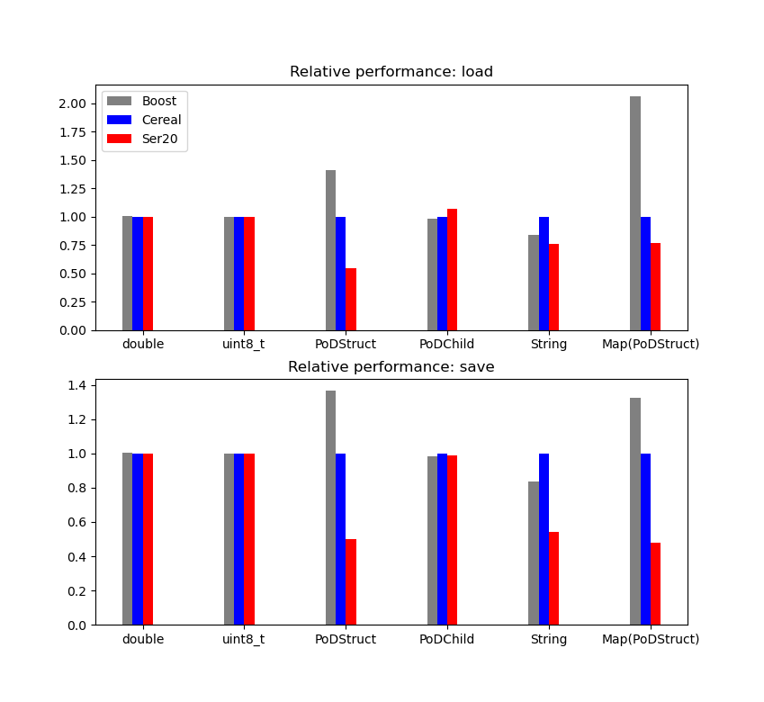

Ser20 - A C++20 library for serialization
==========================================

Ser20 is a C++20 fork of cereal, a C++11 serialization library. It is completely compatible
except for a namespace change. Thanks to modern meta-programming, Ser20 is 15% smaller and 
can compile up to 25% faster. Ser20 also has some other runtime optimizations, and is optimized for debug experience and debug symbols size.

Ser20 requires compiler support for C++20 concepts. Clang 13 and GCC10 should be modern enough,
but CI testing is not set up very hermetically yet.

### Using Ser20

#### Installation

The best way to use Ser20 is with CMake. Ser20 is not header-only, which means that a compilation step is necessary to use it.
The simplest way to do that is to use Ser20 as a subproject in your CMake project.

#### Usage

Using Ser20 is pretty simple. Except for a new namespace, it is completely compatible with Ser20
and therefor pretty compatible with boost::serialize as well.

This is a simple usage example:

```cpp
#include <ser20/types/unordered_map.hpp>
#include <ser20/types/memory.hpp>
#include <ser20/archives/binary.hpp>
#include <fstream>
    
struct MyRecord {
  uint8_t x, y;
  float z;

  template <class Archive> void serialize(Archive& ar) { ar(x, y, z); }
};

struct SomeData {
  int32_t id;
  std::shared_ptr<std::unordered_map<uint32_t, MyRecord>> data;

  template <class Archive> void save(Archive& ar) const { ar(data); }

  template <class Archive> void load(Archive& ar) {
    static int32_t idGen = 0;
    id = idGen++;
    ar(data);
  }
};

int main() {
  std::ofstream os("out.bin", std::ios::binary);
  Ser20::BinaryOutputArchive archive(os);

  SomeData myData;
  archive(myData);

  return 0;
}
```

### Performance

Although it's by far not the fastest serialization library out there, Ser20 is
sometimes two times as fast as cereal and boost::serialization in binary serialization:



This difference is mostly due to buffering of small reads and writes to ostreams.

## Ser20 has a permissive license

Ser20 is licensed under the [BSD license](http://opensource.org/licenses/BSD-3-Clause).

## Ser20 build status

* [](https://github.com/royjacobson/ser20/actions/workflows/ci.yml)
* [](https://github.com/royjacobson/ser20/actions/workflows/ci-macos.yml)
<!---
* [](https://ci.appveyor.com/project/AzothAmmo/Ser20/branch/master)

--->

---
